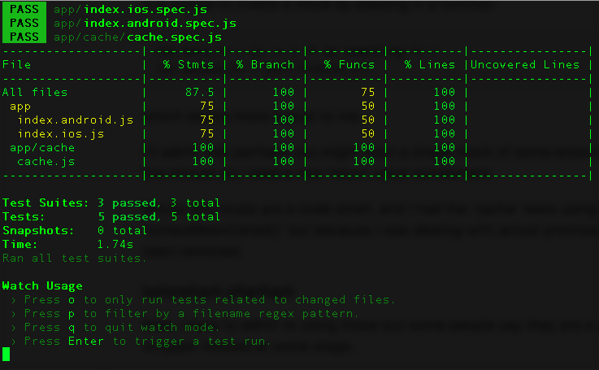
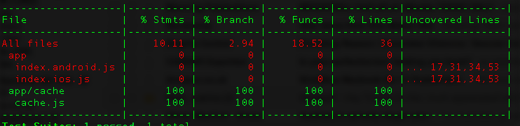

## Jest

NOTE: I gave up on Jest in the end because due to 'death by a thousand cuts' syndrome. It shouldn't be this hard to get properly working tests.

I can't say I'm liking it much as I don't like Jasmine much and it uses Jasmine as a stepping-off point, I prefer AVA which sorta, kinda, mostly is based on TAP. 

I'll stick with it and learn it as it *is* the default and apparently *snapshots* are wonderful.

### Some caveats, pet hates, comments
I don't like Jamsine, and because Jest appears to be a 'better Jasmine' in many ways, I don't much like the API. I have some comments below...

#### Jasmine...

'Nuff said.

#### \__MOCKS\__
I don't really see the point of writing such individual test-specific mocks in a separate file in a separate folder.

It is simple to create a mock by passing in a function

    let mock_fn = () => { /* do something */ }
    let mocked_fn = jest.fn(mock_fn)
    
which seems more logical to me.

I'll admit that perhaps you might want a single mock of some external dependency, but I can see that being outgrown the minute you need a new return value somewhere.

Mocks and stubs are a code smell, and I had the 'cache' tests using them originally to assert against 'toHaveBeenCalled()' but because I was dealing with actual promises I could check in other ways and the mocks have been removed.

#### beforeEach afterEach
Now, I have to admit to using these but some people say they are a code smell, and I agree, I'll move to using a wrapper instead at some stage.
  
#### \__TESTS\__
Sorry, I'm 100% convinced these should be placed beside the source they are testing. Having them in a separate folder seems so archaic and wrong-headed.

Having said that, it is simple to update the *package.json* to allow them to be picked up from wherever they are in the code

    "jest": {
        "preset": "react-native",
            :
            "testRegex": "\\.spec\\.js"
            :
    }

#### Code coverage 
Great, yeah, built-in like most decent test frameworks these days. Seems fine.

This is easily setup using globbing patterns to include the files you want to find coverage on and exclude the ones you don't - tests files, coverage reports, node_modules etc.

    "jest": {
            "preset": "react-native",
            :
            "collectCoverage": true,
            "collectCoverageFrom": ["**/*.{js,jsx}", "!**/node_modules/**", "!**/*.spec.js", "!coverage/**/*.js"]
            :
    }
    
Update: actually, we have a problem here. If I run the tests using 'watch' the first run looks like this

the subsequent runs look like the previous results, as do any results when I run the tests without the watch statement. Looks like a bug to me :/ 
